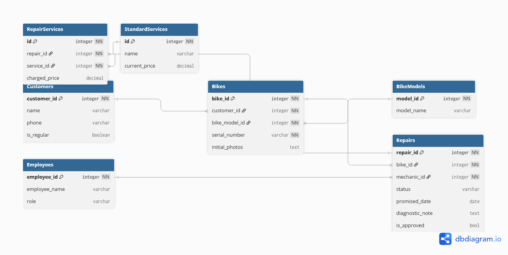

# Domain Model
## Diagram 



## DBML Code
```
Table Customers {
  customer_id integer [pk, not null] 
  name varchar
  phone varchar
  is_regular boolean
}

Table Employees {
  employee_id integer [pk, not null]
  employee_name varchar
  role varchar
}

Table Bikes {
  bike_id integer [pk, not null]
  customer_id integer [not null, ref: > Customers.customer_id]
  bike_model_id integer [not null, ref: > BikeModels.model_id]
  serial_number varchar [not null]
  initial_photos text
}

Table BikeModels {
  model_id integer [not null, pk]
  model_name varchar
}

Table Repairs {
  repair_id integer [not null, pk]
  bike_id integer [not null, ref: > Bikes.bike_id]
  mechanic_id integer [not null, ref: > Employees.employee_id]
  status varchar
  promised_date date
  diagnostic_note text
  is_approved bool

}

Table StandardServices {
  id integer [not null, pk]
  name varchar
  current_price decimal
}

Table RepairServices {
  id integer [not null, pk]
  repair_id integer [not null, ref: > Repairs.repair_id]
  service_id integer [not null, ref: > StandardServices.id]
  charged_price decimal
}
```

## Lifecycle

### Allowed States

`Received` -> `Diagnosed` -> `Waiting Approval` -> `Approved` -> `In Progress` -> `Ready` -> `Picked Up`

### Alternative Paths

`Waiting Approval` -> `Rejected` -> `Picked Up`

### Disallowed Transitions
* A repair can not go from `Received` directly to `Ready` or `In Progress` (It must be diagnosed and approved first)
* A repair can not go from `Rejected` to `In Progress`
* A repair can not go backwards from `Picked Up` to `In Progress`

# Entity History

| Entity    | Justifying User Story |
| :-------: | :---------------------: |
| Customers | As a counter clerk, I want to know if a customer is a regular, so that a discount can be applied. |
| Employees | As a mechanic, I want to change a bike's status to "ready", so that the counter clerk knows the job is done without having to walk to the back of the workshop. |
| BikeModels | As a counter clerk, I want to record a bike's arrival with its details, tag number, and initial photos, so that we have an accurate digital record of what entered the shop.|
| Bikes | As a counter clerk, I want to record a bike's arrival with its details, tag number, and initial photos, so that we have an accurate digital record of what entered the shop.| 
| Repairs | As a shop owner, I want to see a list of repairs that have passed their promised date, so that I can identify delayed bikes before the customer calls to complain.| 
| StandardServices | As a shop owner, I want to update the master list of repair jobs and prices, so that the shop charges the correct new rates when January comes.|
| RepairServices | As a mechanic, I want to add specific standard jobs (e.g., wheel true, brake bleed) to a bike's repair ticket, so that the total cost is accurately calculated from our standard list.| 


# Decisions 
* The solution to prevent the mix-up from march, the system separates the bikes and the models in two tables: `BikeModels` for the generic description and `Bikes` for the actual physical unit. A single table with a quantity column would fail to answer this problem because it only tracks how many identical bikes are in the shop, making it impossible to link a specific serial number to its rightful owner.

* There's no total `price_column` in `Repairs` table, this is because the total price can be (and it must be) calculated using the `charged_price` of all the repair services related to the fix. If is was saved like a column the data possibly would desincronize.

* The `charged_price` in the `RepairServices` table is saved in here because the prices increase every January. If is not saved the prices would be updated automatically.

